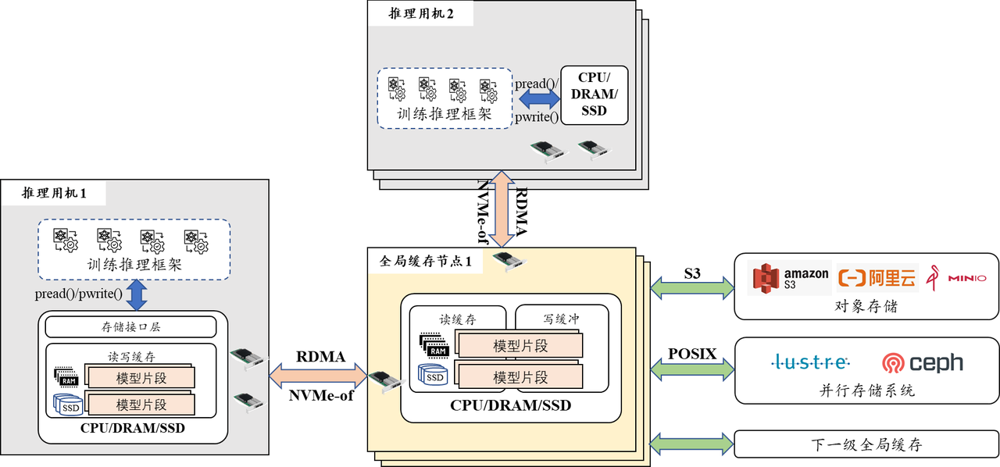

# JYCache

**九源缓存存储系统（简称：JYCache）** 是一款面向个人使用、大模型训练推理等多种场景，适配大容量对象存储等多种底层存储形态，高性能、易扩展的分布式缓存存储系统。通过层次化架构、接入层优化、I/O优化等多种组合优化，JYCache 不仅支持文件顺序/随机读写，其读写性能也领先国际主流产品 Alluxio。JYCache 现支持在 X86（Intel、AMD、海光等）及 ARM（鲲鹏、飞腾等）平台下运行。

缓存存储系统面向个人使用及集群使用等场景，可为用户提供以下两种运行模式：
1. **单机对象加速**：将 S3 对象存储通过 POSIX 接口挂载到本地，像本地磁盘一样进行读写访问。S3 上的一个完整对象对应本地的一个文件，通过对象名构造目录树结构。进一步地，热点数据可缓存于本地的 DRAM/SSD，通过减少与 S3 的数据交互操作，可提升文件系统性能。
2. **分布式对象加速**：将 S3 对象存储通过 POSIX 接口挂载到本地，像本地磁盘一样进行读写访问。S3 上的一个完整对象对应本地的一个文件，通过对象名构造目录树结构。热点数据呈现两级缓存结构，除各个客户端内部 DRAM/SSD 缓存外，还提供一层共享的 DRAM/SSD 缓存，进一步提高缓存命中率，提升并发读等场景下的 IO 性能。

## 主要特性

  - **兼容 POSIX 接口**。通过 FUSE 或动态库劫持技术，应用程序无需重新编译即可立即实现缓存存储加速。
  - **高可用缓存写**。数据写入缓存层即可视为持久化，通过多副本、纠删码机制实现缓存层内数据高可用，降低下层存储系统压力，提高 I/O 性能。
  - **支持用户态零拷贝 I/O**。动态库劫持技术（Syscall intercept）实现全用户态 I/O，降低上下文切换和拷贝，实现极限性能。
  - **层次化缓存存储**。本地缓存与计算任务同机部署，使用高速共享缓存可为用户进程提供高达 45GB/s 的缓存带宽；为进一步提高分布式系统缓存效率，可额外部署全局缓存服务，通过与多个本地缓存相关联，进一步提高缓存命中率。
  - **易于扩展和集成**。本地缓存与全局缓存采用模块化设计，可依据业务需要实现多样的组合。
  - **兼容多种平台**。支持在 X86（Intel、AMD、海光等）及 ARM（鲲鹏、飞腾等）平台下运行。

## 系统架构


在单机对象加速部署模式下，对象存储可通过 FUSE（基于S3FS(V1.94)实现） 或系统调用劫持等方式挂载到本地，用户可像本地磁盘一样进行读写访问。对象存储系统上的一个完整对象对应本地的一个文件，通过对象名构造目录树结构。热点数据可缓存于本地的 DRAM/SSD，通过减少与对象存储系统的数据交互操作，可提升文件系统性能。

在分布式对象加速模式下，热点数据呈现两级缓存结构，除各个客户端内部 DRAM/SSD 缓存外，还提供一层共享的 DRAM/SSD 缓存，进一步提高缓存命中率，提升并发读等场景下的 IO 性能。

缓存存储系统的两个核心部件是客户端缓存模块及全局缓存模块。客户端缓存模块内部包含写缓存、读缓存。客户端缓存模块按需向全局缓存服务器发出 RPC 通信请求，实现数据的传递。全局缓存服务器包含写缓存和读缓存，其中写缓存提供多副本等高可用模式。当用户发出下刷（fsync）请求时，写数据会落入此处，可容忍少量全局缓存服务器故障时不丢失写入的数据。无论是读缓存还是写缓存，都会按需调用数据源访问组件访问对象存储等底层存储资源，从而轻松适配其他类型的底层存储。

此外，在intercept模式的缓存系统中，我们采用了client-server+中间件架构，利用系统调用拦截技术捕获POSIX请求，将posix请求封装后发送至服务器处理，处理完成后返回至客户端。通过绕过FUSE内核模块和采用零拷贝中间件，最大限度地减少了数据拷贝和系统开销，不仅确保了与常见posix接口的兼容，还显著提升了系统性能，尤其在读写密集的场景中，避免了数据的重复拷贝，性能优势明显。

## 系统性能

顺序读性能使用 FIO 测试工具，带宽数据如下表所示：

|  BS | 优化前  | JYCache(FUSE) | JYCache(intercept) | 
| ------------ | ------------ | ------------ | ------------ | 
|  4K | 761MiB/s  |  933MiB/s | 3576MiB/s |
|  16K | 706MiB/s | 3643MiB/s  | 11.6GiB/s |
|  128K | 2268MiB/s  |  22.6GiB/s | 38GiB/s |

顺序写性能使用 FIO 测试工具，带宽数据如下表所示：

|  BS | 优化前  | JYCache(FUSE) | JYCache(intercept) | 
| ------------ | ------------ | ------------ | ------------ | 
|  4K | 624MiB/s  |  1226MiB/s | 2571MiB/s | 
|  16K |  2153MiB/s | 5705MiB/s  | 9711MiB/s | 
| 128K  | 7498MiB/s  | 23.5GiB/s  | 31.2GiB/s |

## 系统构建
**环境要求**

- GCC 9.3.0
- GLIBC 2.31
- CMake 3.7
- C++ 17
- FUSE >= 2.6

**从源码构建**

直接在根目录下运行build.sh脚本
```bash
sh build.sh
```
*在build.sh脚本中，会自动下载第三方依赖。*

**系统安装**

编译完成后，在根目录下运行install.sh脚本
```bash
sh install.sh
```

## 快速使用

执行install.sh脚本后会在当前目录下构建JYCache运行环境，其目录为JYCache_Env。下述使用方法均以JYCache_Env为根目录。

**一、JYCache普通模式（不启用全局缓存）**

修改conf/newcache.conf配置文件中的`UseGlobalCache=0`
```bash
# 1.启动minio
cd ./minio && sh start.sh && cd ..
# 2.启动s3fs
sh start_s3fs.sh
```
启动完成后，在挂载目录 ./mnt 下的文件操作均为JYCache控制。

*注：需要在此模式下，在挂载目录 ./mnt 创建文件夹testdir，此为intercept模式所需。*

**关闭服务**
```bash
sh stop_s3fs.sh
cd ./minio && sh stop.sh && cd ..
```

**二、JYCache普通模式（启用全局缓存）**

修改conf/newcache.conf配置文件中的`UseGlobalCache=1`
```bash
# 1.启动minio
cd ./minio && sh start.sh && cd ..
# 2.启动etcd
sh start_etcd.sh
# 3.启动全局缓存
sh start_global.sh
# 4.启动s3fs
sh start_s3fs.sh
```
启动完成后，在挂载目录 ./mnt 下的文件操作均为JYCache控制

**关闭服务**
```bash
sh stop_s3fs.sh
sh stop_global.sh
sh stop_etcd.sh
cd ./minio && sh stop.sh && cd ..
```

**三、JYCache intercept模式**

此模式也支持全局缓存，方法与二同。下述以不开全局缓存为例：
```bash
# 1.启动minio
cd ./minio && sh start.sh && cd ..
# 2.启动intercept_server
sh start_intercept_server.sh
```
启动完成后，在JYCache_Env根目录下执行
```bash
LD_LIBRARY_PATH=./libs/:$LD_LIBRARY_PATH  LD_PRELOAD=./libintercept_client.so ${cmd}
```
其中`${cmd}`为用户实际文件操作的命令。例如：
```bash
LD_LIBRARY_PATH=./libs/:$LD_LIBRARY_PATH  LD_PRELOAD=./libintercept_client.so ll /testdir/
```
需要在testdir目录下进行文件操作，才为JYCache intercept模式控制。
*且使用intercept模式前需要先通过普通模式在挂载目录下创建文件夹testdir。*

**关闭服务**
```bash
sh stop_intercept_server.sh
cd ./minio && sh stop.sh && cd ..
```

## 常见问题

[常见问题](https://www.osredm.com/jiuyuan/JYCache/tree/master/doc/frequently_asked_questions.md)

## 许可

本项目使用了以下遵循GPLv2许可的代码：
- S3FS (https://github.com/s3fs-fuse/s3fs-fuse)

This software is licensed under the GNU GPL version 2.

